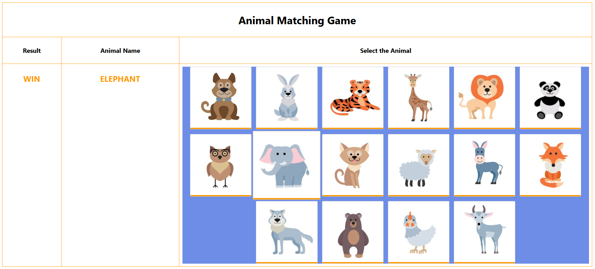
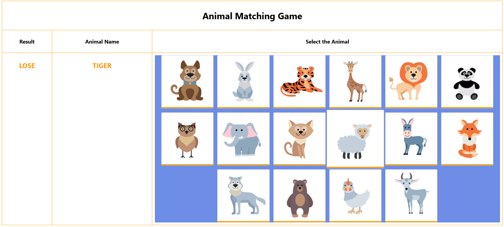

# Animal-Matching-Game

A fun and educational React-based game that helps children improve their object recognition and language skills. The game challenges players to identify animals based on their names and match them to the correct image.

---

## 🛠 Features

- **Randomized Gameplay**:
  - An animal name is randomly selected and displayed at the start of each round.
- **Dynamic Image Display**:
  - A grid of 16 animal images is dynamically generated for every round.
- **Interactive Feedback**:
  - The game evaluates the player's choice instantly and displays the result: "Win" for a correct choice or "Lose" for an incorrect one.

---

## 🎯 Game Objective

The player’s goal is to match the displayed animal name with its correct image among the grid of 16 animal pictures.

---

## 🚀 Getting Started

Follow these steps to set up and run the project on your local machine.

### 1. Prerequisites

Ensure you have the following installed:

- **Node.js** (LTS version recommended)
- **npm** (comes with Node.js)
- **Visual Studio Code** (or any preferred code editor)

---

### 2. Installation Steps

1. **Download the Project**:

   - Locate the project ZIP file in the shared drive.
   - Copy it to your local machine and extract it.

2. **Navigate to the Project Directory**:
   Open the terminal and move into the project folder:
   ```bash
   cd path/to/project
   ```

---

# Output

# 

# 

---
